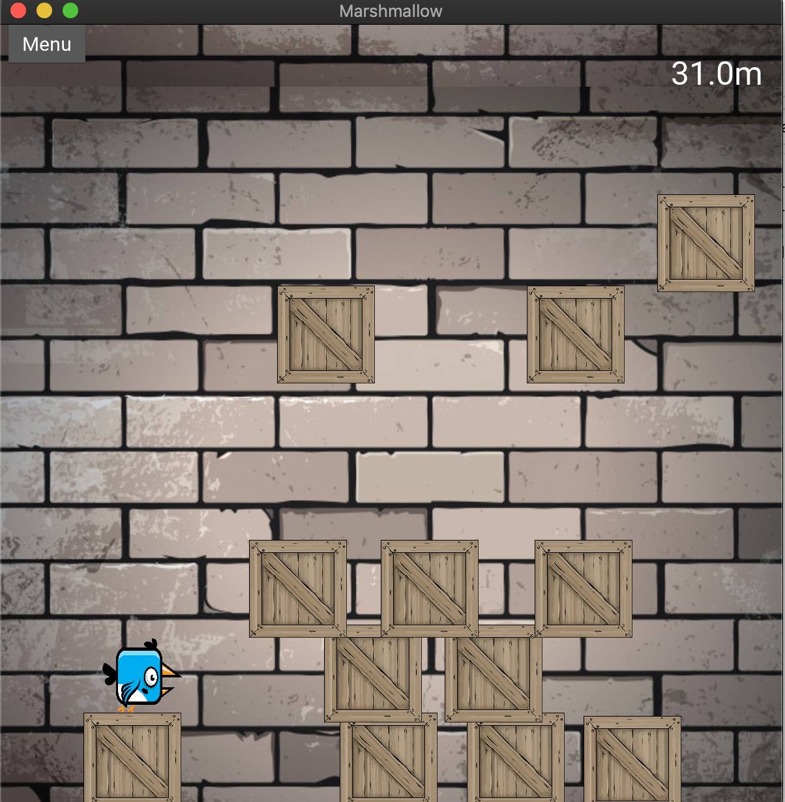

A desktop/mobile cross platform game written in python using the Kivy framework. 
* Similar in concept to the game Avalanche (http://www.addictinggames.com/action-games/avalanche.jsp)
* The aim of the game is to control a character, dodge and use falling objects to gain height. 
* A high height will result in a high score. This game is an ongoing side project to develop competency and skills in python and game development. 
* Will eventually be playable on mobile, making use of the device's accelerometer and multi touch capabilities.

## Screenshot

  

